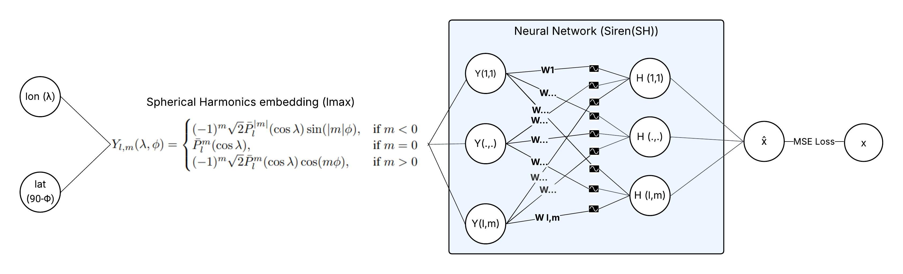

# GravSIRENSH

Repository for hybrid implicit neural representations of the gravity field that combine **Spherical Harmonic (SH) basis functions** with **SIREN networks** (Sitzmann et al., 2020).

## Overview

This repository contains the code used to train **hybrid** and **numerical** gravity field models and compare their predictions with an **analytical** model based on Spherical Harmonics expansions.

- The **hybrid model** combines **Spherical Harmonics embeddings** with a **SIREN neural network**.

<p align="center">
  
</p>

- The **numerical model** follows the approach proposed by **Martin and Schaub (2022)**.

Both models are trained using the **mean squared error (MSE)** loss:

$$
Loss = \frac{1}{N}\sum_{i=1}^{N}\left|x_i-\hat{x}_i\right|^2
$$

where

- $\hat{x}_i$ is the **predicted value**
- $x_i$ is the **true value**

The target variable can correspond to either **gravitational potential** or **gravitational acceleration**.


## Repository Contents

This repository includes:

- **PyTorch implementations** of the hybrid and numerical models  
- **Spherical Harmonic basis functions** implemented using `pyshtools`  
- **Data generators** for training datasets  
- **Logging and visualization tools** for model training and evaluation

## Data

The datasets generated in this repository are publicly available on Zenodo:
https://zenodo.org/records/18945729

In the `generate_data.py` script, you can customize the **maximum spherical harmonic degree** and **number of samples** used to generate the training and test datasets.

## Getting started

You can quickly test the repository using the following **Google Colab notebook**.

[](https://colab.research.google.com/drive/16JEEL-VawhowQTXxNuYSiqGJrqQYjHfe?usp=sharing)

The notebook performs the full workflow:

1. Clones the current repository
2. Installs the required packages
3. Downloads the training and test datasets from Zenodo
4. Trains a **hybrid SIREN(SH) or numerical gravity field model**
5. Provides the equivalent analytical model with the same number of parameters
6. Generates maps visualizing the spatial distribution of the predictions
7. Generates files for predictions and summary of the predictions

### Running the code

To clone the repository and install the requirements locally:

```bash
git clone https://github.com/drestrepoj06/GravSIRENSH.git
cd GravSIRENSH
python -m venv venv
On Windows:
source venv/Scripts/activate
On Linux/macOS:
source venv/bin/activate

pip install -r requirements.txt
pip install -e .
```

## Status

⚠️ This repository is currently intended **for research purposes only** and is **not designed for production use**.

## Code acknowledgements

This repository uses and relies on the following open-source implementations:

- The **SIREN(SH) location encoder** by Rußwurm et al. (2024):  
  [Location Encoder Repository](https://github.com/MarcCoru/locationencoder/tree/main)

- The **Spherical Harmonics gravity field implementation** provided by Wieczorek and Meschede (2018), with tutorials available at:  
  [SHTOOLS Documentation and Tutorials](https://shtools.github.io/SHTOOLS/)

- **PyTorch Lightning** for streamlined model training and experiment management:  
  [PyTorch Lightning](https://github.com/Lightning-AI/pytorch-lightning)

- The **SirenNet implementation** (Sitzmann et al., 2020):  
  [SIREN Repository](https://github.com/vsitzmann/siren)

- The **GRAVNN repository** by Martin and Schaub (2022a, 2022b, 2025):  
  [GravNN Repository](https://github.com/MartinAstro/GravNN)


---

## References

Martin, J., & Schaub, H. (2022a).  
*Physics-informed neural networks for gravity field modeling of the Earth and Moon.*  
Celestial Mechanics and Dynamical Astronomy, 134(2), 13.  
https://doi.org/10.1007/s10569-022-10069-5

Martin, J., & Schaub, H. (2022b).  
*Physics-informed neural networks for gravity field modeling of small bodies.*  
Celestial Mechanics and Dynamical Astronomy, 134(5), 46.  
https://doi.org/10.1007/s10569-022-10101-8

Martin, J., & Schaub, H. (2025).  
*The Physics-Informed Neural Network Gravity Model Generation III.*  
The Journal of the Astronautical Sciences, 72(2), 10.  
https://doi.org/10.1007/s40295-025-00480-z

Rußwurm, M., Klemmer, K., Rolf, E., Zbinden, R., & Tuia, D. (2024).  
*Geographic Location Encoding with Spherical Harmonics and Sinusoidal Representation Networks.*  
The Twelfth International Conference on Learning Representations (ICLR).  
https://openreview.net/forum?id=PudduufFLa

Sitzmann, V., Martel, J., Bergman, A., Lindell, D., & Wetzstein, G. (2020).  
*Implicit Neural Representations with Periodic Activation Functions.*  
Advances in Neural Information Processing Systems (NeurIPS), Vol. 33.  
https://proceedings.neurips.cc/paper_files/paper/2020/file/53c04118df112c13a8c34b38343b9c10-Paper.pdf

Wieczorek, M. A., & Meschede, M. (2018).  
*SHTools: Tools for Working with Spherical Harmonics.*  
Geochemistry, Geophysics, Geosystems, 19(8), 2574–2592.  
https://doi.org/10.1029/2018GC007529
