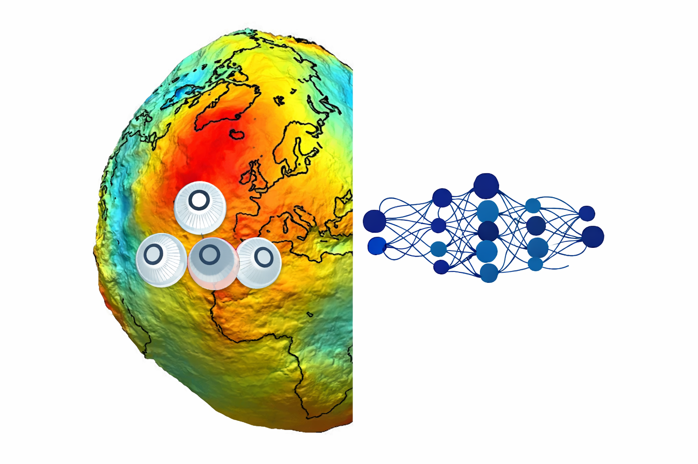

  

# GravSIRENSH

Repository for hybrid implicit neural representations of the gravity field that combine **Spherical Harmonic (SH) basis functions** with **SIREN networks** (Sitzmann et al., 2020).

## Overview

The purpose of this repository is to train **hybrid** and **numerical** gravity field models.

- The **numerical model** follows the approach of Martin and Schaub (2022).
- It uses the standard mean squared error loss:

$$
Loss = \frac{1}{N}\sum_{i=1}^{N}\left|x_i-\hat{x}_i\right|^2
$$

where  
- $\hat{x}$ represents the **predicted value**,  
- $x$ represents the **true value**,  

and the target variable can correspond to either **gravitational potential** or **acceleration**.

## Repository Contents

This repository includes:

- **PyTorch implementations** of the hybrid and numerical models  
- **Spherical Harmonic basis functions** implemented using `pyshtools`  
- **Data generators** for training datasets  
- **Logging and visualization tools** for model training and evaluation  

## Example

The file **`Examples.ipynb`** provides a minimal working example that:

1. Trains a **hybrid gravity field model**
2. Trains a **numerical gravity field model**
3. Visualizes the spatial distribution of the results

## Status

⚠️ This repository is currently intended **for research purposes only** and is **not designed for production use**.

## Code acknowledgements

This repository uses and relies on the following open-source implementations:

- The **SIREN(SH) location encoder** by Rußwurm et al. (2024):  
  [Location Encoder Repository](https://github.com/MarcCoru/locationencoder/tree/main)

- The **Spherical Harmonics gravity field implementation** provided by Wieczorek and Meschede (2018), with tutorials available at:  
  [SHTOOLS Documentation and Tutorials](https://shtools.github.io/SHTOOLS/)

- **PyTorch Lightning** for streamlined model training and experiment management:  
  [PyTorch Lightning](https://github.com/Lightning-AI/pytorch-lightning)

- The **SirenNet implementation** (Sitzmann et al., 2020):  
  [SIREN Repository](https://github.com/vsitzmann/siren)

- The **GRAVNN repository** by Martin and Schaub (2022a, 2022b, 2025):  
  [GravNN Repository](https://github.com/MartinAstro/GravNN)

---

## References

Martin, J., & Schaub, H. (2022a).  
*Physics-informed neural networks for gravity field modeling of the Earth and Moon.*  
Celestial Mechanics and Dynamical Astronomy, 134(2), 13.  
https://doi.org/10.1007/s10569-022-10069-5

Martin, J., & Schaub, H. (2022b).  
*Physics-informed neural networks for gravity field modeling of small bodies.*  
Celestial Mechanics and Dynamical Astronomy, 134(5), 46.  
https://doi.org/10.1007/s10569-022-10101-8

Martin, J., & Schaub, H. (2025).  
*The Physics-Informed Neural Network Gravity Model Generation III.*  
The Journal of the Astronautical Sciences, 72(2), 10.  
https://doi.org/10.1007/s40295-025-00480-z

Rußwurm, M., Klemmer, K., Rolf, E., Zbinden, R., & Tuia, D. (2024).  
*Geographic Location Encoding with Spherical Harmonics and Sinusoidal Representation Networks.*  
The Twelfth International Conference on Learning Representations (ICLR).  
https://openreview.net/forum?id=PudduufFLa

Sitzmann, V., Martel, J., Bergman, A., Lindell, D., & Wetzstein, G. (2020).  
*Implicit Neural Representations with Periodic Activation Functions.*  
Advances in Neural Information Processing Systems (NeurIPS), Vol. 33.  
https://proceedings.neurips.cc/paper_files/paper/2020/file/53c04118df112c13a8c34b38343b9c10-Paper.pdf

Wieczorek, M. A., & Meschede, M. (2018).  
*SHTools: Tools for Working with Spherical Harmonics.*  
Geochemistry, Geophysics, Geosystems, 19(8), 2574–2592.  
https://doi.org/10.1029/2018GC007529
